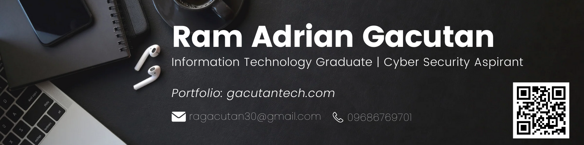

## Hi there 👋

I'm **Ram Adrian N. Gacutan**, an aspiring Information Technology professional with a passion for both technical and creative fields. I recently graduated with a Bachelor of Science in Information Technology from Don Mariano Marcos Memorial State University, Mid La Union Campus.

### 🔭 I’m currently working on ...
- Enhancing my skills in video editing and graphic design.
- Developing new programming projects to further my knowledge.

### 🌱 I’m currently learning ...
- Advanced programming languages and frameworks.
- Latest trends in UX/UI design.

### 👯 I’m looking to collaborate on ...
- Open-source projects related to web development and software engineering.
- Creative video editing and graphic design projects.

### 🤔 I’m looking for help with ...
- Expanding my professional network in the IT industry.
- Finding mentorship opportunities to guide my career growth.

### 💬 Ask me about ...
- Video editing with Adobe Premiere Pro and After Effects.
- Programming in C, Java, Dart, Python, and other languages.

### 📫 How to reach me: ...
- Email: ragacutan30@gmail.com
- Phone: +63 968 676 9701

### 😄 Pronouns: ...
- He/Him

### ⚡ Fun fact: ...
- I love experimenting with new software tools and technologies to push my creative and technical limits.

